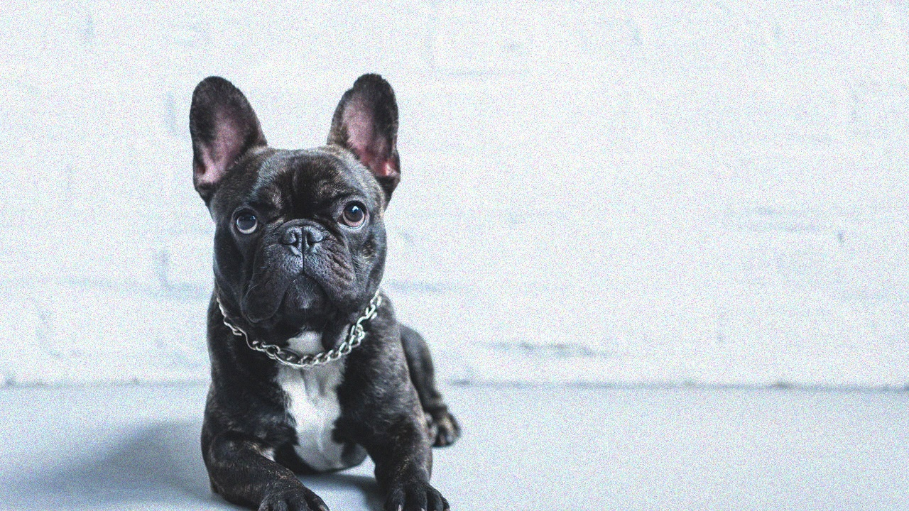
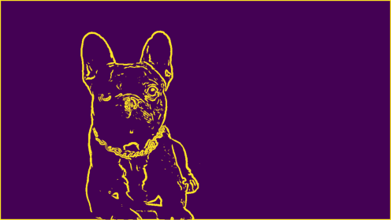

# Turtle Draw - Visao Computacional + ROS 2

[Video de demonstracao](https://youtu.be/UwwN39IwaeE)

<div align="center">
Figura 1: imagem original usada como entrada.


</div>

Pipeline de visao computacional feita do zero que extrai o contorno da silhueta da imagem acima e um pacote ROS 2 que faz a tartaruga do turtlesim desenhar esse contorno na tela.

<div align="center">
Figura 2: contorno processado gerado pelo pipeline.


</div>

## Estrutura

```text
ros_turtlesim/
├── img/
│   ├── dog.jpg
│   └── dog_processed.png
├── notebook/
│   └── notebook.ipynb
├── points/
│   └── points.json
├── src/
│   └── turtle/
│       ├── turtle/
│       │   └── turtle.py
│       ├── resource/
│       │   ├── points.json
│       │   └── turtle
│       ├── package.xml
│       └── setup.py
├── requirements.txt
└── README.md
```

## Dependências

- ROS 2 (Humble ou compativel) com turtlesim
- Python 3 com numpy, opencv (apenas para imread), matplotlib e jupyter

## Como executar

### 1. Notebook

```bash
cd notebook
jupyter notebook
```

Abra [notebook/notebook.ipynb](notebook/notebook.ipynb) e rode todas as celulas. A ultima celula salva [src/turtle/resource/points.json](src/turtle/resource/points.json).

### 2. Desenhar

```bash
colcon build --packages-select turtle
source install/setup.bash
ros2 run turtle turtle_draw
```
